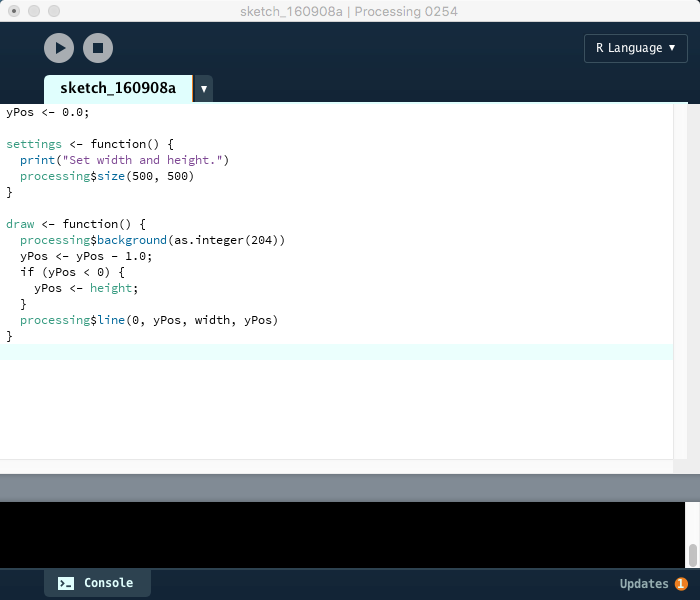
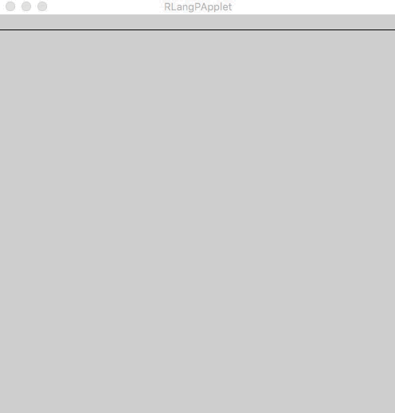

# HOWTO

## Play with Docker

* `docker pull quay.io/gaocegege/processing.r`
* `docker run quay.io/gaocegege/processing.r`
* Open the link of NoVNC in a web browser and the default password is `process`. Input it in the URL and play with Processing.R in a desktop environment:)

See [the demo in vimeo :)](https://vimeo.com/207571123)

## In Your Native Environment

* Clone [processing/processing](https://github.com/processing/processing)
* Install JDK 1.8
* Install Processing app

### Editor Support

* Replace paths in `./scripts/generate-ant-file.sh` with the paths in your environment.
* Run `./scripts/generate-ant-file.sh` to get a valid build.xml
* Run `ant install`, you will get a mode in `processing/modes`.





### Runner.jar

Processing.R offers a jar, which allows to have a try without the installation of Processing app. 

Run `ant try`, you will get a runner in `try/`, and run `java -jar ./try/RLangMode.jar <your R script>`.

```r
posAX <- 11
posAY <- 22

posBX <- 33
posBY <- 22

processing$line(posAX, posAY, posBX, posBY)
```

The output is:


