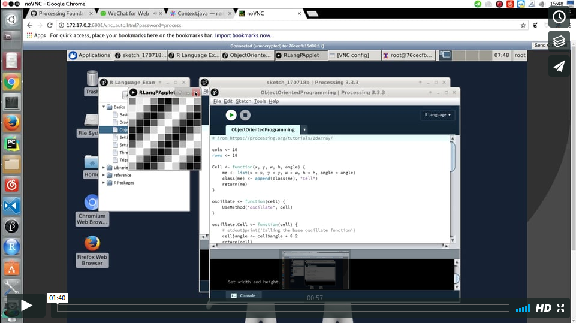

# Compiling Processing.R

The latest release of Processing.R may be installed:

1. Into the Processing Development Environment (PDE) via the Contributions Manager: PDE > Add Tool > Modes > Processing.R.
1. By downloading the latest [release](https://github.com/processing-r/Processing.R/releases). This may be used stand-alone or installed into PDE by adding to the Processing Libraries folder and restarting PDE. The mode will appear in the PDE Modes list once installed.
1. **By compiling / building from source**

The following instructions cover compiling Processing.R from source. It may be built in several ways:

1. a PDE mode, which can be
    - added to the PDE
    - built with its own PDE
1. a command-line runner -- does not require the PDE
1. a docker container image -- DEPRECATED

## PDE Mode

**Warning:** Many parts of PDE integration are still incomplete: files cannot be double-clicked or dragged to open so code must be cut-pasted into the window, saved files cannot be reopened except through the recent files dialog list, the run button launches multiple window rather than re-running, stop button does not work, etc.

Building Processing.R from source requires [ant](ant.apache.org/).

1. checkout Processing.R from github
1. configure `./scripts/generate-ant-file.sh`
1. build and install mode into PDE using `ant build`
1. start PDE and select `R Language` from mode drop-down menu

### Configure script

Configure `./scripts/generate-ant-file.sh`:

- `modes`: the destination for installing the mode once it is built.
  - MacOSX: `/Users/[MyUserName]/Documents/Processing/modes/`
  - Windows: `%homepath%\Documents\Processing\modes\`
  - Linux: `${HOME}/sketchbook/modes/`
- `core` and `pde`: paths to core library and pde.jar. They are be used to build runner and run test cases.
  - MacOSX: `/Applications/Processing.app/Contents/Java/core/library` and `/Applications/Processing.app/Contents/Java/pde.jar`
  - Linux: `[MyPDE]/core/library` and `[MyPDE]/lib/pde.jar`
- `executable`: optional argument giving the location of the PDE.
  - The path is used in `ant run` to start a PDE instance. Leave blank to not launch PDE on `ant run`.
  - MacOSX: `/Applications/Processing.app/Contents/MacOS/Processing`
  - Linux: `[MyPDE]/processing`

#### A) configure for adding to an existing PDE

For example, to install the mode into a default existing PDE app on a MacOS system, set arguments in `./scripts/generate-ant-file.sh` such as:

```
modes="/Users/[MyUserName]/Documents/Processing/modes"
core="/Applications/Processing.app/Contents/Java/core/library"
pde="/Applications/Processing.app/Contents/Java/pde.jar"
executable="/Applications/Processing.app/Contents/MacOS/Processing"
```

This will generate build.xml errors (as the core and pde directories only contain the actual jars, not source). However it will work correctly.

#### B) configure for creating a new PDE

Build the source code of Processing core and pde wherever it is located on the system. For example:

```bash
$ cd processing/core
$ ant build
$ cd processing/app
$ ant build
```

Then set the two paths accordingly in `./scripts/generate-ant-file.sh`:

```
modes="${HOME}/Documents/Processing/modes"
core="../processing/core/library/"
pde="../processing/app/pde.jar"
executable="/Applications/Processing.app/Contents/MacOS/Processing"
```

### Install

- Run `./scripts/generate-ant-file.sh`
  - this will generate a valid build.xml
- Run `ant install`
  - the mode will be installed into PDE

<div align="center">
	
</div>

<div align="center">
	
</div>

## Command Line Runner: RLangMode.jar

Processing.R offers a runner which allows users to execute .rpde scripts directly from the command line without requiring the PDE app.

To build the runner:

- Run `ant try`

This will create a jar file `RLangMode.jar` in `try/`

To use the runner:

- Run `java -jar ./try/RLangMode.jar <your R script>`
  - The script should be a valid .rpde file.

```r
posAX <- 11
posAY <- 22

posBX <- 33
posBY <- 22

line(posAX, posAY, posBX, posBY)
```

The output is:

<div align="center">
	
</div>

## Docker Image (DEPRECATED)

[](https://quay.io/repository/gaocegege/processing.r)

**NOTICE:** The docker image of Processing.R is currently deprecated, since graphic card is not fully supported in Docker. 3D sketches couldn't work in the docker container.

Docker containers provide a lightweight virtual environment that package up Linux applications with everything that they need to run.

In order to install a docker image and then launch a docker container of Processing.R running in a virtual Linux desktop environment:

1. install docker on your system
1. `docker pull quay.io/gaocegege/processing.r`
1. `docker run quay.io/gaocegege/processing.r`
1. open the link of NoVNC `http://<IP of the container>:6901/vnc_auto.html?password=process` in a web browser.
1. play with Processing.R in a desktop environment :)

See the video in vimeo:

<div align="center">
	<a href="https://vimeo.com/225961911"></a>
</div>
