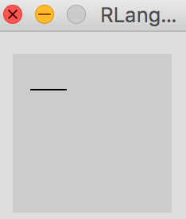

# HOWTO

If you just want to have a try, then there is no need to read this documentation, you could get the distribution from [gaocegege.com/Processing.R](http://gaocegege.com/Processing.R)

## Play with Docker

* `docker pull quay.io/gaocegege/processing.r`
* `docker run quay.io/gaocegege/processing.r`
* Open the link of NoVNC in a web browser and the default password is `process`. Input it in the URL and play with Processing.R in a desktop environment:)

See [the demo in vimeo :)](https://vimeo.com/207571123)

## In Your Native Environment

* Clone [processing/processing](https://github.com/processing/processing)
* Change the code [here](https://github.com/processing/processing/blob/master/app/src/processing/app/Base.java#L404), from `mode/java` to `mode/RLangMode`.
* Change the code [here](https://github.com/processing/processing/blob/master/app/src/processing/app/Base.java#L918), from `processing.mode.java.JavaMode` to `rprocessing.mode.RLangMode`.
* Install JDK 1.8
* `cd build; ant build`

### Editor Support

* Replace paths in `./scripts/generate-ant-file.sh` with the paths in your environment.
* Run `./scripts/generate-ant-file.sh` to get a valid build.xml
* Run `ant install`, you will get a mode in `processing/modes`.

<div align="center">
	
</div>

<div align="center">
	
</div>

### Runner.jar

Processing.R offers a jar, which allows to have a try without the installation of Processing app. 

Run `ant try`, you will get a runner in `try/`, and run `java -jar ./try/RLangMode.jar <your R script>`.

```r
posAX <- 11
posAY <- 22

posBX <- 33
posBY <- 22

processing$line(posAX, posAY, posBX, posBY)
```

The output is:

<div align="center">
	
</div>
