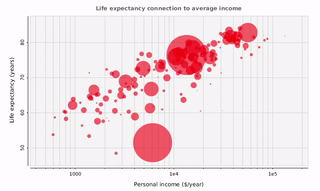
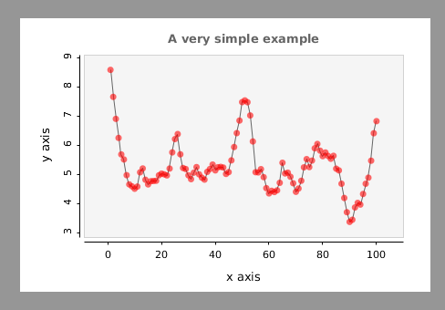
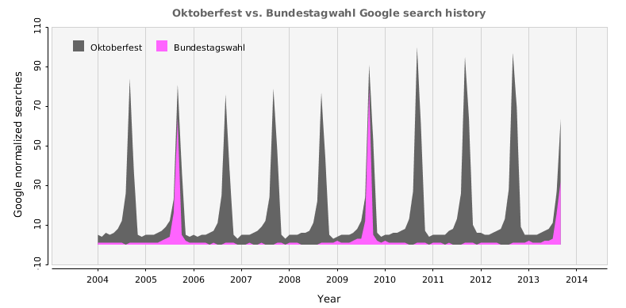
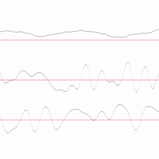
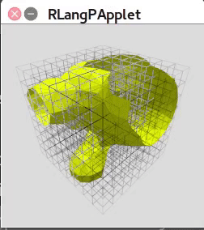
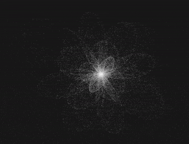
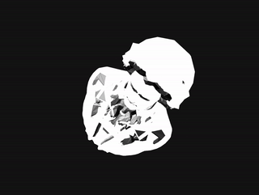

<h1 align="center">
    
  <br>
</h1>

<h4 align="center">Processing.R enables users to write Processing sketches in R.</h4>

<p align="center">Current Maintainer: <a href="https://github.com/jeremydouglass">@jeremydouglass</a> from
U. California Santa Barbara</p>

<p align="center">
    <a href="https://travis-ci.org/gaocegege/Processing.R"></a>
    <a href="https://ci.appveyor.com/project/gaocegege/processing-r/branch/master"></a>
    <!--<a href="https://quay.io/repository/gaocegege/processing.r"></a>-->
    <a href="https://www.codacy.com/app/gaocegege/Processing-R?utm_source=github.com&amp;utm_medium=referral&amp;utm_content=gaocegege/Processing.R&amp;utm_campaign=Badge_Grade"></a>
    <!--<a href="https://www.codacy.com/app/gaocegege/Processing-R?utm_source=github.com&amp;utm_medium=referral&amp;utm_content=gaocegege/Processing.R&amp;utm_campaign=Badge_Coverage"></a>-->
    <a href="https://stackshare.io/gaocegege/processing-r"></a>
    <a href="https://github.com/processing-r/Processing.R/releases"></a>
    <a href="https://gitter.im/gaocegege/Processing.R?utm_source=badge&amp;utm_medium=badge&amp;utm_campaign=pr-badge"></a>
    <a href="https://github.com/processing-r/Processing.R/blob/master/raw-docs/devel/compilation.md#docker-image-deprecated"></a>
</p>

## Overview

Processing.R is a mode for Processing that enables users to write Processing sketches using the R language. The mode can be installed in the Processing Development Environment (PDE). It can also run on the command line as a stand-alone jar.

Processing.R supports:

1. native R programming and syntax
1. most Processing built-in functions (`draw()`, `rect()`, `box()`, etc.)
1. importing select Processing(Java) libraries (e.g. "peasycam")
1. importing select R Packages (e.g. "foreach")

<div align="center">
	
</div>
<br>
<p align="center">
</img>
</img>
</img>
</p>

<p align="center">
</img>
</img>
</img>
</img>
</img>
</p>

## Early Development

Processing.R is still in early development -- it is not feature-complete or production-ready. Please try our experimental mode and give us your feedback.

-  Report bugs to [Processing.R Issues](https://github.com/processing-r/Processing.R/issues)!
-  Chat at the [Processing.R gitter channel](https://gitter.im/gaocegege/Processing.R)

## Installation

Processing.R is currently available via PDE > Add Tool > Modes, you could install the mode in PDE.

To build the mode from source, see [compilation.md](./raw-docs/devel/compilation.md).

### Built-in functions in Processing

Processing.R supports most of the Processing functions as described in the [Processing reference](processing.org/reference/). Processing.R functions are described on the documentation website:

-  [https://processing-r.github.io/reference](https://processing-r.github.io/reference).

However, the Processing.R documentation is currently incomplete. Many functions have not been tested or are not accompanied by example sketches. Some reference pages contain materials from Processing.py or Processing(Java) that have not been edited to reflect differences from other Processing modes.

### Processing Libraries: `importLibrary()`

Processing.R supports importing standard Processing(Java) libraries that enrich the functionality of Processing. The function `importLibrary()` imports new libraries manually. This has been tested with one library: [peasycam](http://mrfeinberg.com/peasycam/), the "dead-simple mouse-driven camera for Processing."

Before trying the example code below, first install the corresponding library `peasycam` -- for example using the PDE Contribution Manager > Library.

```r
settings <- function() {
    importLibrary("peasycam")
    size(200, 200, P3D)
}

setup <- function() {
    cam = PeasyCam$new(processing, 100)
    cam$setMinimumDistance(50)
    cam$setMaximumDistance(500)
}

draw <- function() {
    rotateX(-.5)
    rotateY(-.5)
    background(0)
    fill(255, 0, 0)
    box(30)
    pushMatrix()
    translate(0, 0, 20)
    fill(0, 0, 255)
    box(5)
    popMatrix()
}
```

### R Packages: `library()`

Processing.R has limited support for R packages. It will automatically download R packages that are requested using the `library()` function, so you can use packages directly.

Here is an example using the `foreach` package:

```r
library(foreach)

foreach(i=1:3) %do%
    print(sqrt(i))
```

In practice we have only found a few R packages so far that work with Processing.R "out of the box." This is because the package must be pure R  **and** all of its dependencies must also be pure R. There is [renjin list of R packages](http://packages.renjin.org/) which lists their compatibility with the renjin JVM. Any package fully supported in renjin is theoretically supported in Processing.R.

## Documentation

<a href="https://www.netlify.com">
  
</a>

See [https://processing-r.github.io/](https://processing-r.github.io/). The documentation is generated from [https://github.com/processing-r/Processing.R-docs-tools](https://github.com/processing-r/Processing.R-docs-tools).

## Papers

- [Short Paper about Processing.R](./raw-docs/paper/processing-r.pdf)

## CONTRIBUTING

Feel free to hack on Processing.R! [development.md](./raw-docs/development.md) will help you to get involved into the development of Processing.R.

## CHANGELOG

See [CHANGELOG](./CHANGELOG.md)

## AUTHORS

See [AUTHORS](./AUTHORS.md)

## Acknowledgments

* Thanks [processing](https://github.com/processing/processing) for the Processing Development Environment(PDE).
* Thanks [renjin](https://github.com/bedatadriven/renjin) for its awesome JVM-based interpreter for the R language.
* Thanks [Jeremy Douglass](https://github.com/jeremydouglass) for mentoring me in Google Summer of Code 2017.
